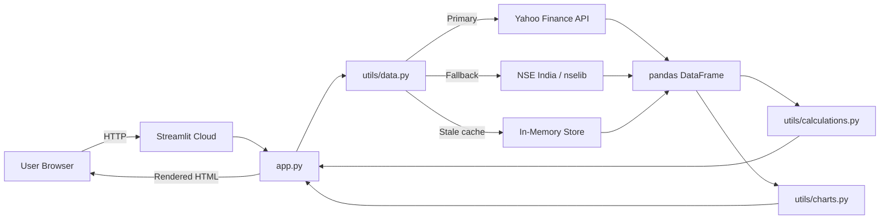

# Nifty 50 Tracker

**A production-grade, real-time NSE market tracker built with Streamlit and Python.**

[](https://share.streamlit.io)
[](https://python.org)
[](https://github.com/jyotheeswar012-max/nifty50-stock-tracker/blob/main/LICENSE)
[](https://jyotheeswar012-max.github.io/nifty50-stock-tracker/)

---

## What Is This?

The Nifty 50 Tracker gives you a single-page dashboard for everything happening on India's National Stock Exchange:

- **Live prices** during market hours (9:15 AM–3:30 PM IST) via 1-minute intraday bars
- **Last session close** prices with change metrics when the market is closed
- **All 50 Nifty companies** with sector filters, change rankings, and colour-coded bars
- **P&L Calculator** — enter buy price, sell price, and quantity; get instant profit/loss + beta-adjusted impact scenarios
- **Time Machine** — travel back to any NSE trading day since 2010 and see the full Nifty 50 snapshot
- **Structured logging** — every error, warning, and key user action written to `logs/app.log` with timestamps

---

## Architecture at a Glance

```
nifty50-stock-tracker/
├── app.py                  ← Streamlit entry point (UI only)
├── utils/
│   ├── data.py             ← All data fetching (yfinance → nselib → stale cache)
│   ├── calculations.py     ← Pure calculation helpers (testable, no I/O)
│   ├── charts.py           ← Plotly chart builders (pure functions)
│   ├── constants.py        ← Symbols, indices, cache TTL, colour palette
│   └── logger.py           ← Centralised logging (RotatingFileHandler + console)
├── pages/                  ← Reserved for future Streamlit multi-page expansion
├── tests/                  ← pytest test suite
├── docs/                   ← This documentation site
└── logs/                   ← Runtime log files (gitignored)
```

### Data Flow



---

## Quick Start

```bash
git clone https://github.com/jyotheeswar012-max/nifty50-stock-tracker.git
cd nifty50-stock-tracker
pip install -r requirements.txt
streamlit run app.py
```

See [Installation](getting-started/installation.md) for a full walkthrough including virtual environments, Streamlit Cloud deployment, and optional `nselib` fallback setup.

---

## Key Design Decisions

| Decision | Rationale |
|---|---|
| **yfinance as primary source** | Battle-tested, global CDN, supports OHLCV + 1-min intraday, no API key required |
| **nselib as fallback** | Official NSE India REST API — activates automatically when Yahoo Finance is down |
| **`@st.cache_data` everywhere** | Prevents redundant network calls on every Streamlit re-run |
| **Pure calculation functions** | `calculations.py` has zero Streamlit/I/O imports — 100% unit-testable |
| **RotatingFileHandler** | Keeps `logs/app.log` under 5 MB × 3 backups — no disk bloat on long-running servers |
| **No ML models (intentional)** | Price prediction is out of scope; the app is a *transparency* tool, not a trading signal generator |

---

## Pages Overview

| Tab | What It Shows |
|---|---|
| Market Overview | All NSE indices snapshot + normalised trend comparison |
| Nifty 50 Index | `^NSEI` candlestick/line/area chart with period selector |
| All 50 Companies | Full table with sector filter + % change bar chart |
| Gainers & Losers | Top N gainers and losers side-by-side |
| P&L Calculator | Profit/loss + beta-adjusted impact scenario |
| Stock Chart | Per-stock chart with period and chart-type selector |
| Time Machine | Historical snapshot for any date since 2010 |
